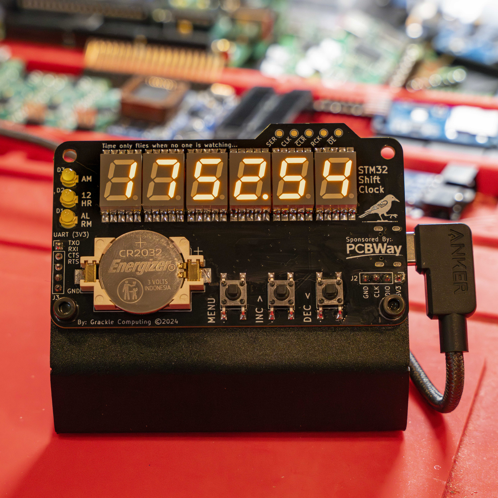
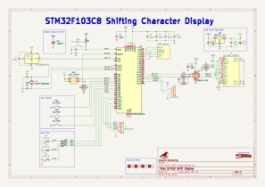
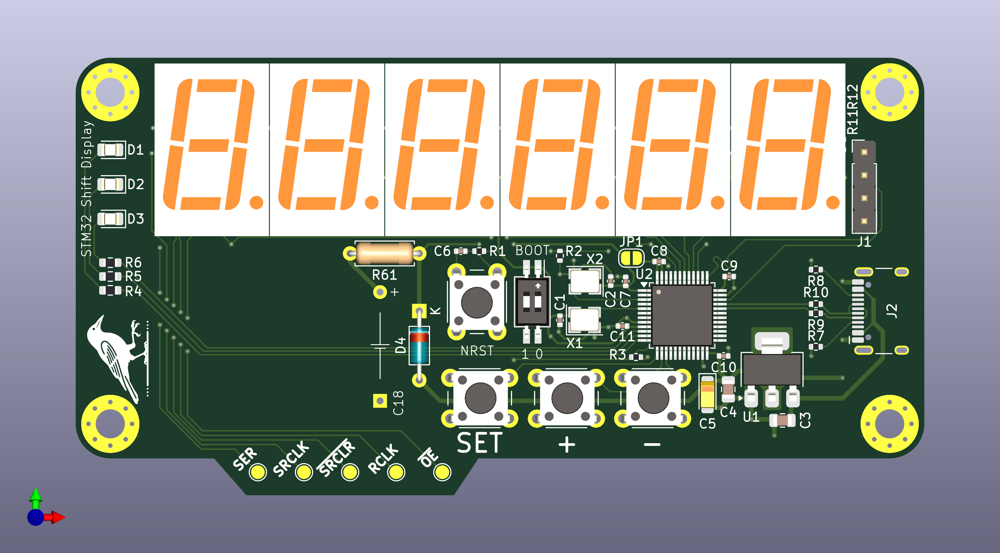

# STM32 Shift Display

A proof-of-concept STM32 based development board designed for experimentation with 74x595 driven 7-segment LED character displays.

## Current Revision
Sponsored by: 

Due to a generous sponsorship from PCBWay the current hardware revision (rev 1) includes a number of substantial design changes over the initial revision:
-  All SMD components from rev 0 moved to the back.
-  Most THT components from rev 0 changed to hand-solder friendly SMD components.
-  Supercap backup for VBAT switched to more common CR2032 battery holder.
-  Addition of ESD IC for the USB connection and a correction for an issue with the USB FS series and pull-up resistors.
-  Move to a 4 layer PCB and use of via-in-pad resin plug with copper capping to simplify routing.
-  Addition of an aluminum sheet metal stand.
-  Remap latch OE pin and user LED pins to PWM capable outputs.
-  Break out UART3 "just in case".

### Revision Objectives
Issues with the USB connection in the first revision (rev 0) made a second revision necessary in order to support UART communication over the USB connection. While the USB termination bug was the primary driver for spinning a new board, there were also a few other short comings of the original design that became apparent during firmware development. The choice of shift registers to drive the LED displays instead of multiplexing made writing the display driver code simple but gave up the brightness control (from PoV) that comes "for free" with that approach. The 74HC595 has an output enable control signal that _maybe_ could be used to achieve a similar effect, so this revision includes a remapping of some of the signals, including the user LEDs, to pins on the MCU that support hardware PWM. 

As the objective of this project is as much learning as arriving at a finished "product", I took the opportunity to try out a number of new things as well. Did you know that PCBWay does sheet metal bending?

### Pushing the Envelope
With a green light to "showcase capabilities" from PCBWay, I wanted to make something worth showing off. After reviewing the website and discovering their 3D printing/CNC milling service I decided to design something that would take advantage of more than just PCBWay's PCB printing capabilities. While the core of this project would remain a development board for STM32F1 hardware and software design, this sponsored revision would be the "STM32 Shift Clock". After a brief affair with a split board design I landed on the simple board and stand design above. This design allowed me to highlight three of PCBWay's capabilities that make them great board partners for hobbyists and professionals alike. First, the PCB is a 4-layer design utilizing [via-in-pad to simplify the routing](./hardware/assets/via-in-pad.PNG) between the shift registers and LEDs characters. PCBWay's engineers were great to work with on this and made the process of indicating which vias needed to be filled and capped simple. Which was really great because KiCad does not currently have a way to indicate if a specific via should be filled. Second, I moved all of the tiny (i.e. too hard to hand solder) components to the back of the board and relied on PCBWay's turnkey PCB assembly service to source the parts and do the hard work of getting all those tiny bits in the right spots. Again, PCBWay's engineers made the process of approving the parts selection and confirming placement and orientation easy. I used LCSC as the supplier for all of the parts on this board and all I had to do was indicate the LCSC part numbers and PCBWay took care of the rest. Their engineers even sent pictures of the boards in production so that I could visually inspect all of the parts placements. And finally, the stand. I've only ever dabbled in 3D printing and certainly never with metal. So when I saw that PCBWay could do low volume sheet metal bending I had to try it out. What followed was a caffeine fueled afternoon of YouTube tutorials and frustrating attempts to get the idea in my head out into FreeCAD. In the end I went with a very simple design that displays the PCB nicely while keeping it from tipping/sliding when pressing the buttons. I chose 5052 Aluminum with a bead blasted and anodized finish to match the PCB. Given the materials and manual labor involved I was really pleased with how reasonable the quoted cost was per piece. All in all I was very impressed with my interactions with PCBWay for this project. From the initial design submissions to the engineering verification and the customer service interactions PCBWay helped me take an idea from mind to matter and I look forward to working with them again on my future projects.

## Schematic

## Board Render
